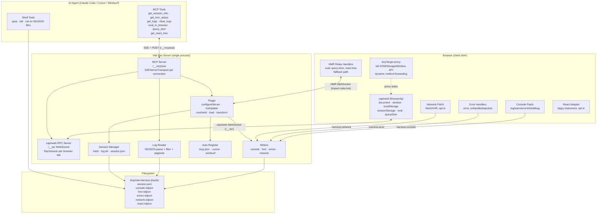
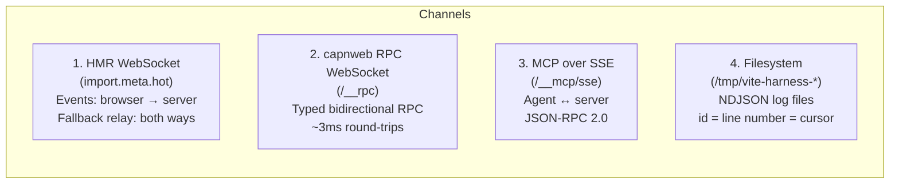
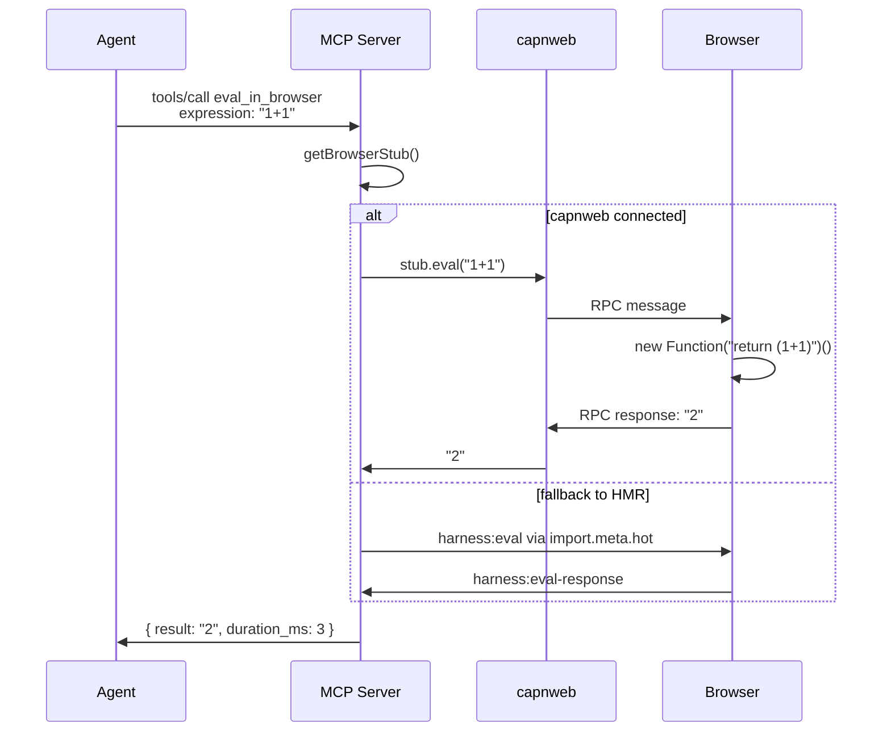
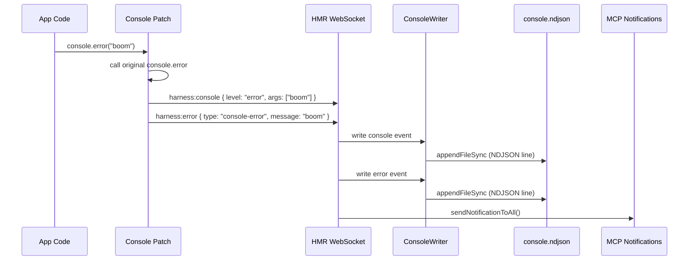
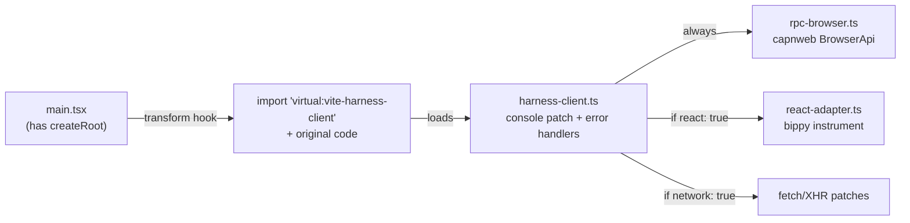

# Architecture

## System Overview



## Communication Channels



### 1. HMR WebSocket (import.meta.hot)

Vite's built-in WebSocket. Browser pushes events via `import.meta.hot.send('harness:*', payload)`. Server listens with `server.hot.on('harness:*', handler)` and writes to NDJSON files. Also used as fallback for eval/query when capnweb isn't connected.

### 2. capnweb RPC WebSocket (/__rpc)

[capnweb](https://github.com/cloudflare/capnweb) object-capability RPC. Browser exposes `BrowserApi extends RpcTarget` with `document`, `window`, `localStorage`, `sessionStorage` getters. Each returns an `AnyTarget` proxy that dynamically forwards any property access or method call to the real browser object. Full DOM/Storage/Window API available without explicit declarations. ~3ms per call.

### 3. MCP over SSE (/__mcp/sse)

`@modelcontextprotocol/sdk` with `SSEServerTransport`. Each SSE connection gets its own `McpServer` instance. Tool handlers share state via `McpContext`.

### 4. Filesystem (NDJSON)

Event logs in `/tmp/vite-harness-{hash}/`. Each line: `{ id, ts, channel, payload }`. Files truncated on dev server start, rotated at `maxFileSizeMb`.

## Data Flow: eval_in_browser



## Data Flow: Console Event → NDJSON



## Virtual Module Injection



All virtual modules are plain JavaScript — Vite does not run TypeScript transforms on virtual modules.

## Component Map

```
src/
  index.ts              ← exports viteLiveDevMcp()
  plugin.ts             ← Vite plugin hooks, wires everything together
  mcp-server.ts         ← MCP tool definitions, SSE transport, relay helpers
  rpc-server.ts         ← capnweb WebSocket server, browser stub management
  session.ts            ← session ID, log dir, session.json, file truncation
  log-reader.ts         ← NDJSON reader with filtering/pagination
  auto-register.ts      ← writes .mcp.json, .cursor/mcp.json, .windsurf/mcp.json
  cli.ts                ← bin entry, wraps vite createServer
  types.ts              ← shared TypeScript interfaces
  writers/
    base.ts             ← NdjsonWriter (sync append, rotation), BufferedNdjsonWriter
    console.ts          ← console channel writer
    hmr.ts              ← HMR channel writer + status tracking
    errors.ts           ← errors channel writer
    network.ts          ← network channel writer (100ms buffered)
  client/
    harness-client.ts   ← browser shim: console patch, error handlers, fetch/XHR,
                           HMR relay handlers (eval, query-dom), loads RPC + react
    rpc-browser.ts      ← capnweb BrowserApi + AnyTarget dynamic proxy
    react-adapter.ts    ← bippy fiber hook + tree traversal (opt-in)
```
