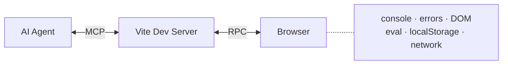
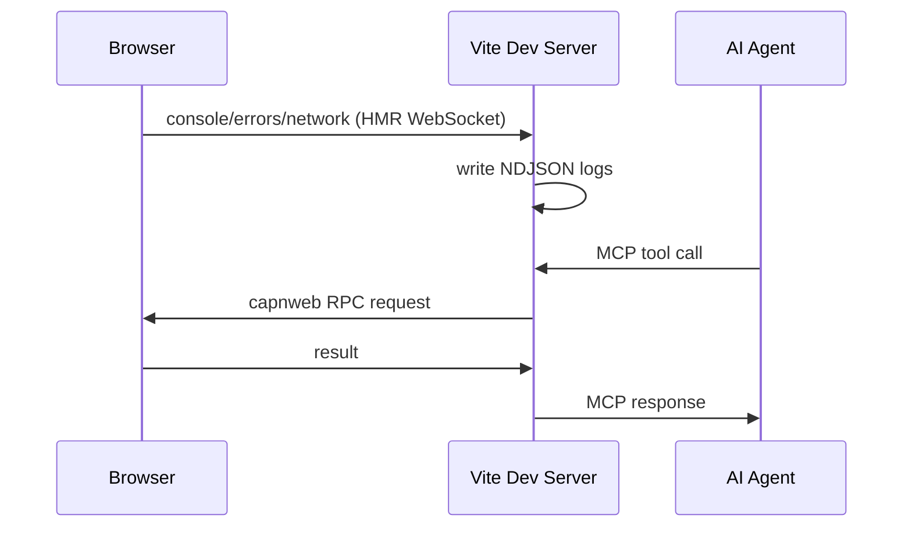

# vite-live-dev-mcp

Vite plugin that gives AI coding agents live observability and browser control during development — console logs, HMR events, network requests, DOM queries, and JS evaluation — via NDJSON log files, an embedded MCP server, and bidirectional RPC.



## Quick Start

```bash
npm install -D vite-live-dev-mcp
```

```ts
// vite.config.ts
import { defineConfig } from 'vite'
import react from '@vitejs/plugin-react'
import { viteLiveDevMcp } from 'vite-live-dev-mcp'

export default defineConfig({
  plugins: [
    react(),
    viteLiveDevMcp({
      network: true,   // opt-in: log fetch/XHR requests
      // react: true,   // opt-in: enable get_react_tree (requires bippy)
    }),
  ],
})
```

Or use the CLI wrapper (auto-injects the plugin, no config changes needed):

```bash
npx vite-live-dev-mcp
npx vite-live-dev-mcp --network --port 3000
```

On startup:

```
  ➜  vite-live-dev-mcp: http://localhost:5173/__mcp/sse
  ➜  CDP endpoint: http://localhost:5173/__cdp
  ➜  log dir: /tmp/vite-harness-a3f9b2
```

Add the MCP server to your `.mcp.json`:

```json
{
  "mcpServers": {
    "my-app-vite-mcp": {
      "type": "sse",
      "url": "http://localhost:5173/__mcp/sse"
    }
  }
}
```

## MCP Tools

### Observation

| Tool | Purpose |
|---|---|
| `get_session_info` | Returns log dir, file paths, server URL. Call first to orient. |
| `get_diagnostics` | **Consolidated diagnostics** — console + errors + network logs + HMR status + auto-computed summary in a single call. Replaces 4-5 separate `get_logs()` calls. **2-3x faster** for agent test/fix loops. Supports `since_checkpoint` filtering. |
| `get_hmr_status` | HMR update/error counts, pending state. Lightweight poll. |
| `get_logs` | Query log files with cursor pagination, level filtering, text search. |
| `clear_logs` | Truncate log files. Call before a fix iteration for a clean slate. Now sets a checkpoint timestamp for `get_diagnostics(since_checkpoint=true)`. |
| `get_react_tree` | React component tree snapshot (requires `react: true` + `bippy`). |

### Browser Control

| Tool | Purpose |
|---|---|
| `eval_in_browser` | Run arbitrary JavaScript in the browser, return the result. |
| `query_dom` | Query DOM by CSS selector, return cleaned HTML with agent-controlled depth, attributes, and text truncation. |
| `wait_for_condition` | **Server-side polling** — blocks until browser condition (JS expression) is truthy or timeout. Eliminates manual polling loops. Default: 5s timeout, 100ms interval. |

## How It Works



Three communication channels:

1. **HMR WebSocket** (`import.meta.hot`) — browser pushes events (console, errors, network) to server, which writes them to NDJSON files. Also used as fallback for eval/query.

2. **capnweb RPC WebSocket** (`/__rpc`) — bidirectional object-capability RPC. Server holds proxy stubs to browser objects (`document`, `window`, `localStorage`, `sessionStorage`). Full DOM/Storage/Window API available via dynamic proxy — any property or method call is transparently forwarded. ~3ms per round-trip.

3. **CDP WebSocket** (`/__cdp/devtools/...`) — Chrome DevTools Protocol endpoint for Playwright `connectOverCDP`. Proxies CDP commands through capnweb RPC to Chobitsu (in-browser CDP implementation).

## Playwright Integration

Connect Playwright to your running dev server without launching a separate browser:

```javascript
import { chromium } from 'playwright'

// Connect to the live browser
const browser = await chromium.connectOverCDP('http://localhost:5173/__cdp')
const page = browser.contexts()[0].pages()[0]

// Interact with the dev page
await page.click('button')
console.log(await page.title())
```

CDP endpoints:
- `/__cdp/json/version` — browser version info
- `/__cdp/json` — list of connected pages
- `/__cdp/devtools/browser` — WebSocket for latest browser
- `/__cdp/devtools/page/:id` — WebSocket for specific browser by ID

## Agent Workflow

### Fast Path (Recommended)

```
# 1. Orient
get_session_info → note file paths, server URL

# 2. Before a task
clear_logs → clean slate (sets checkpoint)

# 3. Make code changes (HMR fires automatically)

# 4. Check results with single call
get_diagnostics({ since_checkpoint: true })
→ Returns: console logs, errors, network, HMR status, summary stats
→ Summary: error_count, warning_count, failed_requests, has_unhandled_rejections
→ 2-3x faster than separate get_logs() calls

# 5. Wait for async conditions
wait_for_condition({ check: "document.querySelector('.loaded')" })

# 6. Inspect the DOM
query_dom({ selector: "#root", max_depth: 2 })
eval_in_browser({ expression: "document.title" })

# 7. If broken: read errors, fix, repeat from step 2
```

### Granular Path (for targeted queries)

```
# Use individual tools when you need specific filtering:
get_hmr_status → any errors?
get_logs({ channel: "errors", limit: 10 })
get_logs({ channel: "console", search: "counter", since_id: 5 })
```

## API Details

### get_diagnostics

Consolidated endpoint that returns all log channels + HMR status + summary stats in a single call.

**Parameters:**
- `since_checkpoint` (boolean) — Filter events since last `clear_logs()`. Default: false
- `since_ts` (number) — Filter events since Unix timestamp (ms)
- `limit` (number) — Max events per channel. Default: 50, max: 200
- `level` (string) — Filter by level (e.g. "error", "warn")
- `search` (string) — Text search across event payloads (case-insensitive)

**Returns:**
```typescript
{
  hmr: {
    last_update_at: number | null
    last_error_at: number | null
    last_error: string | undefined
    update_count: number
    error_count: number
    pending: boolean
  },
  logs: {
    console: HarnessEvent[]
    errors: HarnessEvent[]
    network: HarnessEvent[]
  },
  summary: {
    error_count: number
    warning_count: number
    failed_requests: number
    has_unhandled_rejections: boolean
  },
  checkpoint_ts: number | null
}
```

**Example:**
```javascript
// After clear_logs(), get all new events
const diag = await get_diagnostics({ since_checkpoint: true })

if (diag.summary.error_count > 0) {
  console.log('Errors:', diag.logs.errors)
}
```

### wait_for_condition

Server-side polling that blocks until a browser condition is truthy or timeout.

**Parameters:**
- `check` (string, required) — JavaScript expression to evaluate (must return truthy)
- `timeout` (number) — Timeout in ms. Default: 5000
- `interval` (number) — Poll interval in ms. Default: 100

**Returns:**
```typescript
{
  success: boolean
  value: any  // final value of expression
  elapsed_ms: number
}
```

**Example:**
```javascript
// Wait for element to appear
await wait_for_condition({
  check: "document.querySelector('.success-message')",
  timeout: 10000
})

// Wait for counter to reach value
await wait_for_condition({
  check: "window.__counter >= 5",
  interval: 50
})
```

### clear_logs (with checkpoint)

Truncates log files and sets a checkpoint timestamp. Use `get_diagnostics({ since_checkpoint: true })` to see only new events after the checkpoint.

**Parameters:**
- `channels` (string[]) — Channels to clear. Default: all active. Pass `['all']` for all.

**Example:**
```javascript
// Clear logs before making changes
await clear_logs()

// Make changes, wait for HMR...

// Get only new events since checkpoint
const diag = await get_diagnostics({ since_checkpoint: true })
```

## Options

```ts
viteLiveDevMcp({
  mcpPath: '/__mcp',            // MCP endpoint path (default: '/__mcp')
  network: false,                // log fetch/XHR (default: false)
  react: false,                  // enable get_react_tree (default: false)
  networkOptions: {
    excludePatterns: ['/__', '/@', '/node_modules'],
  },
  logDir: undefined,             // override tmp dir (default: /tmp/vite-harness-{hash})
  maxFileSizeMb: 10,             // per-channel rotation threshold
  autoRegister: false,           // write .mcp.json etc on startup (default: false)
  notifications: true,           // MCP notifications for errors (default: true)
  printUrl: true,                // print MCP URL on startup (default: true)
})
```

## CLI

```
vite-live-dev-mcp [root] [options]

Options:
  -p, --port <port>       Port (default: 5173)
  --host [host]           Expose to network
  --open                  Open browser on start
  -c, --config <file>     Vite config file
  -m, --mode <mode>       Vite mode
  --network               Capture fetch/XHR requests
  --react                 Enable React tree inspection
  --no-auto-register      Skip writing MCP configs
  -h, --help              Show help
```

The CLI auto-injects the plugin if it's not already in your vite config.

## NDJSON Log Files

```
/tmp/vite-harness-{hash}/
  session.json          ← session metadata
  console.ndjson        ← always active
  hmr.ndjson            ← always active
  errors.ndjson         ← always active
  network.ndjson        ← opt-in (network: true)
  react.ndjson          ← opt-in (react: true)
```

One JSON object per line. `id` = line number = cursor position.

```json
{"id":1,"ts":1742654400123,"channel":"console","payload":{"level":"error","args":["something broke"]}}
{"id":2,"ts":1742654400456,"channel":"console","payload":{"level":"log","args":["counter: 5"]}}
```

`{hash}` is derived from the project root path — stable across restarts. Files are truncated on each dev server start.

## React Tree (opt-in)

```bash
npm install -D bippy
```

```ts
viteLiveDevMcp({ react: true })
```

## Requirements

- Vite 6+
- Node 20.19+
- React 17–19 (for `react: true` with bippy)

## License

MIT
