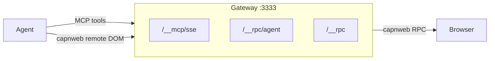
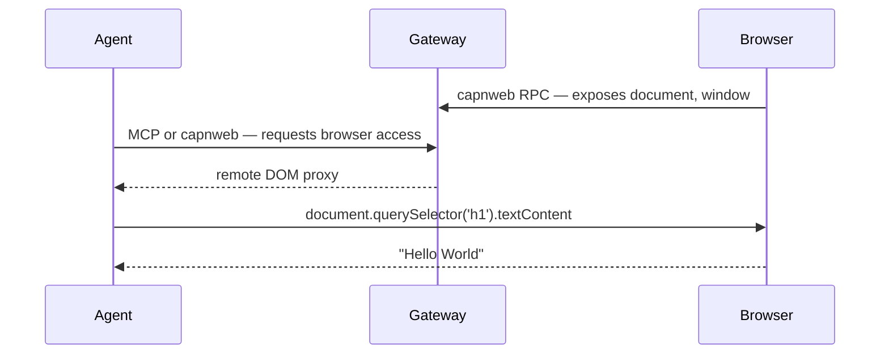

# web-dev-mcp

Give AI agents live browser access during development. Console logs, DOM queries, screenshots, form filling, page navigation — via MCP tools or direct remote DOM access through [capnweb](https://blog.cloudflare.com/capnweb-javascript-rpc-library/).



## Quick Start

### 1. Start the gateway

```bash
npx web-dev-mcp-gateway
```

### 2. Open your dev app or any site through it

```bash
# Your dev server
npx web-dev-mcp-gateway --target http://localhost:5173

# Or browse any URL through the gateway proxy
# http://localhost:3333/https://example.com/
```

### 3. Connect your agent

Add to `.mcp.json`:
```json
{
  "mcpServers": {
    "web-dev-mcp": {
      "type": "sse",
      "url": "http://localhost:3333/__mcp/sse"
    }
  }
}
```

## MCP Tools (core)

Three tools. `eval_js_rpc` does most of the work.

**`get_diagnostics`** — server-side console logs + errors + network + HMR/build status in one call. Use `since_checkpoint: true` after `clear` for clean reads.

**`clear`** — reset logs and/or capnweb session state. Call before a code change.

**`eval_js_rpc`** — run JavaScript server-side with `document` and `window` as [capnweb](https://blog.cloudflare.com/capnweb-javascript-rpc-library/) remote proxies to the browser. CSP-safe, multi-statement, supports await. Persistent `state` object survives across calls.

```js
// Read the page as markdown
eval_js_rpc: return await browser.markdown('#main')

// Click by visible text
eval_js_rpc: await browser.click('text=Submit')

// Fill a form
eval_js_rpc: await browser.fill('#email', 'test@example.com')

// Take a screenshot
eval_js_rpc: return await browser.screenshot('#my-component')

// DOM traversal chain
eval_js_rpc: |
  const link = document.querySelector('a[href*="doom"]')
  const row = link.closest('tr').nextElementSibling
  return await row.querySelector('a:last-child').href

// Store refs across calls
eval_js_rpc: state.heading = document.querySelector('h1'); return await state.heading.textContent
eval_js_rpc: return await state.heading.getAttribute('class')

// Wait for async UI
eval_js_rpc: |
  await browser.click('text=Load')
  const el = await browser.waitFor('.success-toast', 100, 5000)
  return await el.textContent
```

Full tools available at `/__mcp/sse?tools=full` (23 tools including click, fill, screenshot, navigate, query_dom, etc. as individual tools).

## capnweb Agent Client

For coding agents that can run scripts — connect directly and get live remote DOM with [promise pipelining](https://blog.cloudflare.com/capnweb-javascript-rpc-library/).

```js
import { connect } from 'web-dev-mcp-gateway/agent'

const browser = await connect('ws://localhost:3333/__rpc/agent')
const { document } = browser

// Pipelined — batched into minimal round trips
const link = document.querySelector('a[href*="doom-over-dns"]')
const commentsRow = link.closest('tr').nextElementSibling
const commentsHref = await commentsRow.querySelector('.subline a:last-child').href

await browser.navigate(commentsHref)
browser.close()

// Reconnect after page load
const page2 = await connect('ws://localhost:3333/__rpc/agent')
console.log(await page2.document.title)
page2.close()
```

## Install

One package: `web-dev-mcp-gateway`. Dev dependency only.

```bash
npm install --save-dev web-dev-mcp-gateway
```

### Vite

```ts
// vite.config.ts
import { webDevMcp } from 'web-dev-mcp-gateway/vite'

export default defineConfig({
  plugins: [
    react(),
    webDevMcp(),
  ],
})
```

### Next.js

```js
// next.config.js
import { withWebDevMcp } from 'web-dev-mcp-gateway/nextjs'

export default withWebDevMcp(nextConfig)
```

For Turbopack, also add the client component to your layout:

```tsx
// app/WebDevMcpInit.tsx
'use client'
import './web-dev-mcp-instrument.js'  // copy from examples/nextjs-app/app/
export function WebDevMcpInit() { return null }

// app/layout.tsx
import { WebDevMcpInit } from './WebDevMcpInit'
// ... add <WebDevMcpInit /> inside <body>
```

### Then start the gateway

```bash
npx web-dev-mcp-gateway
```

Both frameworks need the gateway running. It's a lightweight daemon on `:3333`.

## Gateway modes

**Proxy** (`--target http://localhost:3000`): reverse proxy, injects client script into HTML responses.

**Hub** (no `--target`): standalone MCP/RPC/capnweb hub. Dev servers connect via adapters. Also supports dynamic proxy — browse `http://localhost:3333/https://any-url.com/` to proxy and instrument any page.

## How it works



The gateway injects a client script into pages that:
- Patches `console.*`, `fetch`, `XMLHttpRequest` to relay events to NDJSON log files
- Connects to `/__rpc` via capnweb WebSocket
- Exposes `document`, `window` as remote objects

The gateway routes browser stubs to MCP tools and agent RPC connections.

## License

MIT
