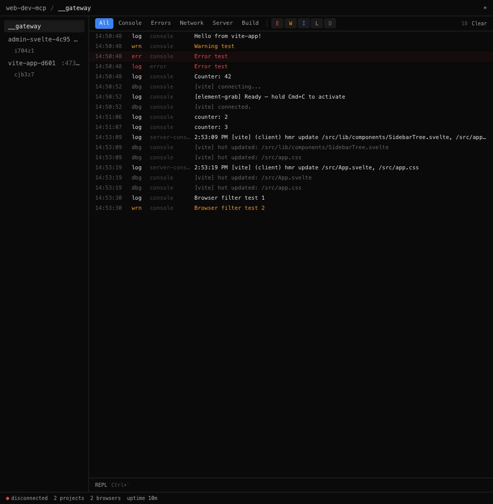
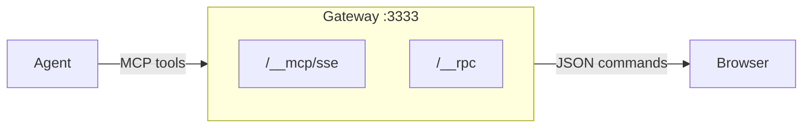
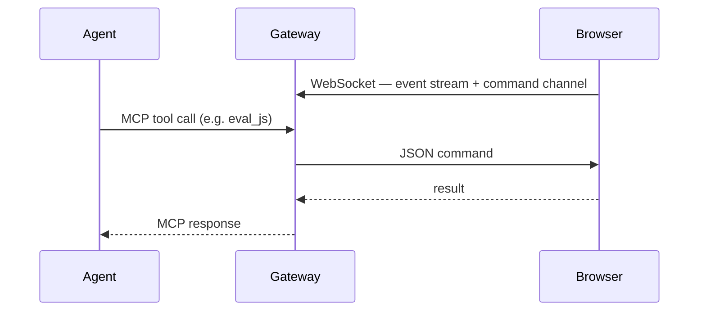

# web-dev-mcp



A dev sidecar that gives AI agents live access to your browser during development. The agent sees what you see — console logs, DOM, screenshots, form state — through your existing browser tab, with your auth, your state, your HMR.

Not a browser automation tool. For that, use Playwright. This is for the dev loop: edit code → check the browser → fix → repeat.



## Quick Start

### 1. Start the gateway

```bash
npx @winstonfassett/web-dev-mcp-gateway
```

### 2. Connect your dev app

Use a framework adapter (see Install section) or the optional proxy plugin:

```bash
npm install web-dev-mcp-proxy  # optional — enables browsing any URL through gateway
# Then: http://localhost:3333/http://localhost:5173/
```

### 3. Connect your agent

```bash
npx @winstonfassett/web-dev-mcp-gateway --auto-register
```

This writes MCP config into `.mcp.json` (Claude), `.cursor/mcp.json`, `.windsurf/mcp.json`, and `.vscode/mcp.json` in one shot.

Or add manually to `.mcp.json`:
```json
{
  "mcpServers": {
    "web-dev-mcp": {
      "type": "sse",
      "url": "http://localhost:3333/__mcp/sse"
    }
  }
}
```

See [getting-started.md](getting-started.md) for the full setup guide.

## MCP Tools (core)

Six tools. `eval_js` does most of the work.

**`get_diagnostics`** — console logs + errors + network + HMR/build status in one call. Use `since_checkpoint: true` after `clear` for clean reads.

**`clear`** — reset logs. Call before a code change.

**`eval_js`** — run JavaScript directly in the browser. Full DOM access, multi-statement, supports await. Promises auto-awaited. Accepts `string | string[]` — array of steps auto-waits for DOM to settle between each.

```js
// Read the page as markdown
eval_js: return browser.markdown('#main')

// Click by visible text
eval_js: browser.click('text=Submit')

// Fill a form
eval_js: browser.fill('#email', 'test@example.com')

// Take a screenshot
eval_js: return browser.screenshot('#my-component')

// DOM traversal
eval_js: |
  const link = document.querySelector('a[href*="doom"]')
  const row = link.closest('tr').nextElementSibling
  return row.querySelector('a:last-child').href

// Store refs across calls
eval_js: state.heading = document.querySelector('h1'); return state.heading.textContent
eval_js: return state.heading.getAttribute('class')

// Auto-waited pipeline (array of steps)
eval_js: ["browser.click('text=Submit')", "return document.querySelector('.toast').textContent"]
```

**`set_project`** / **`list_projects`** / **`list_browsers`** — multi-project management.

Full tools available at `/__mcp/sse?tools=full` (23 tools including click, fill, screenshot, navigate, query_dom, etc. as individual tools).

## Install

One package: `web-dev-mcp-gateway`. Dev dependency only.

```bash
npm install --save-dev @winstonfassett/web-dev-mcp-gateway
```

### Vite

```ts
// vite.config.ts
import { webDevMcp } from '@winstonfassett/web-dev-mcp-vite'

export default defineConfig({
  plugins: [
    react(),
    webDevMcp(),
  ],
})
```

### Next.js

```js
// next.config.js
import { withWebDevMcp } from '@winstonfassett/web-dev-mcp-nextjs'

export default withWebDevMcp(nextConfig)
```

For Turbopack, also add the client component to your layout:

```tsx
// app/layout.tsx
import { WebDevMcpInit } from '@winstonfassett/web-dev-mcp-nextjs/init'
// ... add <WebDevMcpInit /> inside <body>
```

### Then start the gateway

```bash
npx @winstonfassett/web-dev-mcp-gateway
```

Both frameworks need the gateway running. Adapters auto-start it — no separate terminal needed.

## How to connect

**Framework adapters** (recommended): Vite and Next.js adapters inject the client script and forward HMR/build events to the gateway.

**Proxy plugin** (`npm install web-dev-mcp-proxy`): browse `http://localhost:3333/http://any-url/` to proxy and instrument any page. Works with any dev server or website.

**Manual**: add `<script src="http://localhost:3333/__web-dev-mcp.js"></script>` to your HTML.

## How it works



The gateway injects a client script into pages that:
- Patches `console.*`, `fetch`, `XMLHttpRequest` to relay events to NDJSON log files
- Connects to `/__rpc` via WebSocket for JSON commands
- Handles commands: eval, screenshot, click, fill, navigate, queryDom, markdown, etc.

## License

MIT
