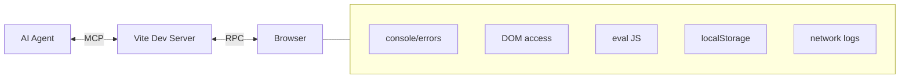
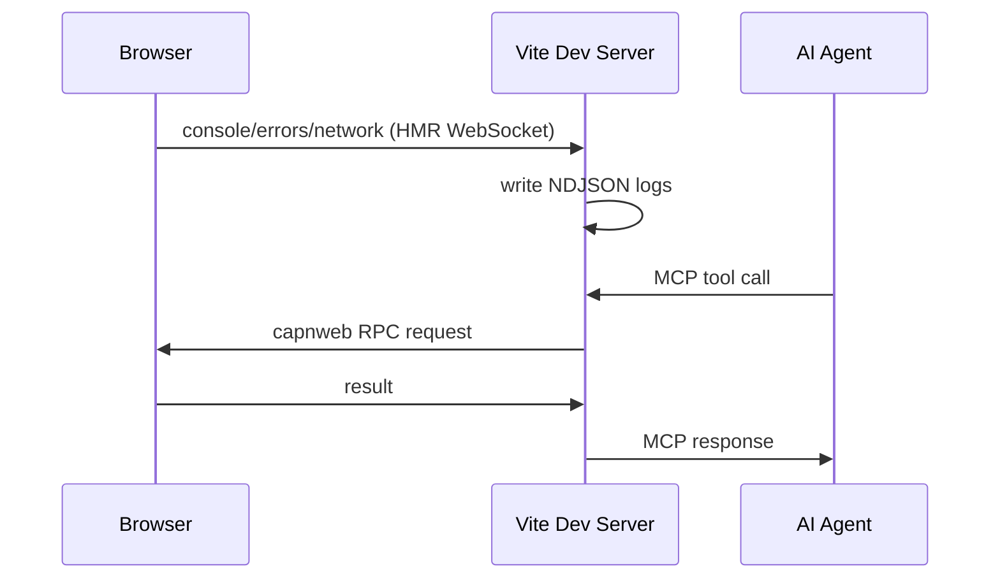

# vite-live-dev-mcp

Vite plugin that gives AI coding agents live observability and browser control during development — console logs, HMR events, network requests, DOM queries, and JS evaluation — via NDJSON log files, an embedded MCP server, and bidirectional RPC.



## Quick Start

```bash
npm install -D vite-live-dev-mcp
```

```ts
// vite.config.ts
import { defineConfig } from 'vite'
import react from '@vitejs/plugin-react'
import { viteLiveDevMcp } from 'vite-live-dev-mcp'

export default defineConfig({
  plugins: [
    react(),
    viteLiveDevMcp({
      network: true,   // opt-in: log fetch/XHR requests
      // react: true,   // opt-in: enable get_react_tree (requires bippy)
    }),
  ],
})
```

Or use the CLI wrapper (auto-injects the plugin, no config changes needed):

```bash
npx vite-live-dev-mcp
npx vite-live-dev-mcp --network --port 3000
```

On startup:

```
  ➜  vite-live-dev-mcp: http://localhost:5173/__mcp/sse
  ➜  log dir: /tmp/vite-harness-a3f9b2
```

Add the MCP server to your `.mcp.json`:

```json
{
  "mcpServers": {
    "my-app-vite-mcp": {
      "type": "sse",
      "url": "http://localhost:5173/__mcp/sse"
    }
  }
}
```

## MCP Tools

### Observation

| Tool | Purpose |
|---|---|
| `get_session_info` | Returns log dir, file paths, server URL. Call first to orient. |
| `get_hmr_status` | HMR update/error counts, pending state. Lightweight poll. |
| `get_logs` | Query log files with cursor pagination, level filtering, text search. |
| `clear_logs` | Truncate log files. Call before a fix iteration for a clean slate. |
| `get_react_tree` | React component tree snapshot (requires `react: true` + `bippy`). |

### Browser Control

| Tool | Purpose |
|---|---|
| `eval_in_browser` | Run arbitrary JavaScript in the browser, return the result. |
| `query_dom` | Query DOM by CSS selector, return cleaned HTML with agent-controlled depth, attributes, and text truncation. |

## How It Works



Two communication channels:

1. **HMR WebSocket** (`import.meta.hot`) — browser pushes events (console, errors, network) to server, which writes them to NDJSON files. Also used as fallback for eval/query.

2. **capnweb RPC WebSocket** (`/__rpc`) — bidirectional object-capability RPC. Server holds proxy stubs to browser objects (`document`, `window`, `localStorage`, `sessionStorage`). Full DOM/Storage/Window API available via dynamic proxy — any property or method call is transparently forwarded. ~3ms per round-trip.

## Agent Workflow

```
# 1. Orient
get_session_info → note file paths, server URL

# 2. Before a task
clear_logs → clean slate

# 3. Make code changes (HMR fires automatically)

# 4. Check results
get_hmr_status → any errors?
get_logs({ channel: "errors", limit: 10 })
get_logs({ channel: "console", search: "counter", since_id: 5 })

# 5. Inspect the DOM
query_dom({ selector: "#root", max_depth: 2 })
eval_in_browser({ expression: "document.title" })

# 6. If broken: read errors, fix, repeat
```

## Options

```ts
viteLiveDevMcp({
  mcpPath: '/__mcp',            // MCP endpoint path (default: '/__mcp')
  network: false,                // log fetch/XHR (default: false)
  react: false,                  // enable get_react_tree (default: false)
  networkOptions: {
    excludePatterns: ['/__', '/@', '/node_modules'],
  },
  logDir: undefined,             // override tmp dir (default: /tmp/vite-harness-{hash})
  maxFileSizeMb: 10,             // per-channel rotation threshold
  autoRegister: false,           // write .mcp.json etc on startup (default: false)
  notifications: true,           // MCP notifications for errors (default: true)
  printUrl: true,                // print MCP URL on startup (default: true)
})
```

## CLI

```
vite-live-dev-mcp [root] [options]

Options:
  -p, --port <port>       Port (default: 5173)
  --host [host]           Expose to network
  --open                  Open browser on start
  -c, --config <file>     Vite config file
  -m, --mode <mode>       Vite mode
  --network               Capture fetch/XHR requests
  --react                 Enable React tree inspection
  --no-auto-register      Skip writing MCP configs
  -h, --help              Show help
```

The CLI auto-injects the plugin if it's not already in your vite config.

## NDJSON Log Files

```
/tmp/vite-harness-{hash}/
  session.json          ← session metadata
  console.ndjson        ← always active
  hmr.ndjson            ← always active
  errors.ndjson         ← always active
  network.ndjson        ← opt-in (network: true)
  react.ndjson          ← opt-in (react: true)
```

One JSON object per line. `id` = line number = cursor position.

```json
{"id":1,"ts":1742654400123,"channel":"console","payload":{"level":"error","args":["something broke"]}}
{"id":2,"ts":1742654400456,"channel":"console","payload":{"level":"log","args":["counter: 5"]}}
```

`{hash}` is derived from the project root path — stable across restarts. Files are truncated on each dev server start.

## React Tree (opt-in)

```bash
npm install -D bippy
```

```ts
viteLiveDevMcp({ react: true })
```

## Requirements

- Vite 6+
- Node 20.19+
- React 17–19 (for `react: true` with bippy)

## License

MIT
