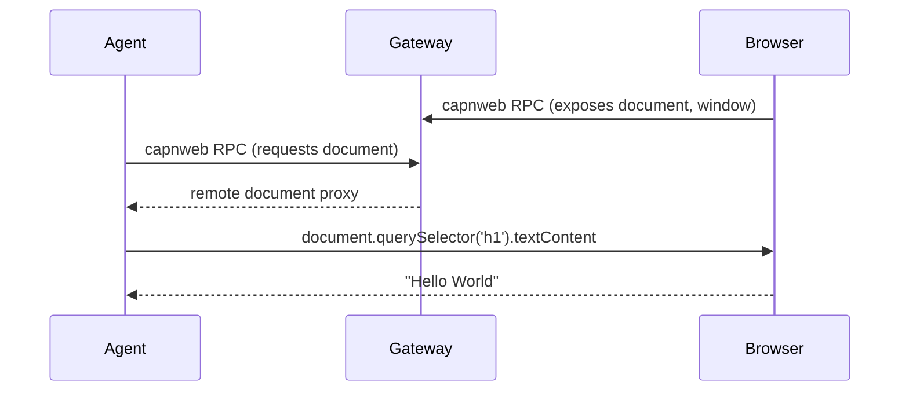

# web-dev-mcp

Give AI agents live browser access during development. Console logs, DOM queries, screenshots, form filling, page navigation — via MCP tools or direct remote DOM access through [capnweb](https://blog.cloudflare.com/capnweb-javascript-rpc-library/).

```mermaid
graph LR
    Agent -->|MCP tools| Gateway
    Agent -->|"capnweb (remote DOM)"| Gateway
    Gateway -->|RPC| Browser

    subgraph Gateway[:3333]
        MCP[/__mcp/sse]
        AgentRPC[/__rpc/agent]
        BrowserRPC[/__rpc]
    end
```

## Quick Start

### 1. Start the gateway

```bash
npx web-dev-mcp
```

### 2. Open any site through it

Browse `http://localhost:3333/https://news.ycombinator.com/` — the gateway proxies and injects instrumentation. Or use with your dev server:

```bash
# Vite
npx web-dev-mcp --target http://localhost:5173

# Or hub mode — Next.js/Vite connect to gateway via adapters
npx web-dev-mcp
```

### 3. Connect your agent

**MCP** (add to `.mcp.json`):
```json
{
  "mcpServers": {
    "web-dev-mcp": {
      "type": "sse",
      "url": "http://localhost:3333/__mcp/sse"
    }
  }
}
```

**capnweb** (direct remote DOM):
```js
import { connect } from 'web-dev-mcp-gateway/agent'

const browser = await connect('ws://localhost:3333/__rpc/agent')
const { document } = browser

const title = await document.querySelector('h1').textContent
await document.querySelector('a.comments').click()

browser.close()
```

## Two interfaces

### MCP Tools — high level, works with any MCP client

| Tool | Purpose |
|---|---|
| `get_page_markdown` | Page as markdown with `[link text](url)` — best way to read a page |
| `get_diagnostics` | Console + errors + network + HMR status in one call |
| `screenshot` | Full page or element, returns PNG |
| `click` / `fill` / `hover` | Interact by CSS selector |
| `navigate` | Go to URL |
| `clear_logs` | Reset checkpoint, then `get_diagnostics(since_checkpoint: true)` for clean reads |

### capnweb Agent Client — live remote DOM

Connect to `/__rpc/agent` and get the browser's actual `document` as a remote proxy. Chain DOM calls with [promise pipelining](https://blog.cloudflare.com/capnweb-javascript-rpc-library/) — multiple calls batch into minimal round trips.

```js
import { connect } from 'web-dev-mcp-gateway/agent'

const browser = await connect('ws://localhost:3333/__rpc/agent')
const { document } = browser

// Pipelined — these chain without individual awaits
const link = document.querySelector('a[href*="doom-over-dns"]')
const commentsRow = link.closest('tr').nextElementSibling
const commentsHref = await commentsRow.querySelector('.subline a:last-child').href

// Navigate
await browser.navigate(commentsHref)

// Reconnect after page load
browser.close()
const page2 = await connect('ws://localhost:3333/__rpc/agent')
console.log(await page2.document.title) // "DOOM Over DNS | Hacker News"
console.log(await page2.document.querySelector('.commtext').textContent)
page2.close()
```

No `eval()`. No CSP issues. Works on any site.

## Packages

| Package | Purpose |
|---|---|
| `web-dev-mcp-gateway` | Universal gateway — proxy, MCP server, capnweb routing |
| `vite-live-dev-mcp` | Vite plugin — embedded MCP server + HMR integration |

### Vite Plugin

```ts
// vite.config.ts
import { viteLiveDevMcp } from 'vite-live-dev-mcp'

export default defineConfig({
  plugins: [
    react(),
    viteLiveDevMcp({ network: true }),
  ],
})
```

### Next.js

```js
// next.config.js
import { withWebDevMcp } from 'web-dev-mcp-gateway/nextjs'

export default withWebDevMcp(nextConfig, {
  gatewayUrl: 'http://localhost:3333',
  network: true,
})
```

Start the gateway (`npx web-dev-mcp`) and Next.js (`npm run dev`). The adapter injects instrumentation via webpack and routes MCP/RPC to the gateway through Next.js rewrites.

## Gateway modes

**Proxy** (`--target`): sits in front of dev server, proxies all traffic, injects client script into HTML.

**Hub** (no `--target`): standalone MCP/RPC hub. Dev servers connect via adapters. Also supports dynamic proxy — `http://localhost:3333/https://any-url.com/` proxies and instruments any page on the fly.

```bash
# Proxy mode
npx web-dev-mcp --target http://localhost:3000

# Hub mode
npx web-dev-mcp

# Hub + dynamic proxy
# Just browse: http://localhost:3333/https://example.com/
```

## How it works

The gateway injects a small client script into pages. This script:
- Patches `console.*`, `fetch`, `XMLHttpRequest` to relay events
- Connects to `/__rpc` via [capnweb](https://blog.cloudflare.com/capnweb-javascript-rpc-library/) WebSocket
- Exposes `document`, `window` as remote objects via `AnyTarget` proxy

The gateway holds browser stubs and routes them to:
- **MCP tools** — predefined operations (screenshot, click, diagnostics)
- **Agent RPC** (`/__rpc/agent`) — direct remote DOM access for agents



## License

MIT
