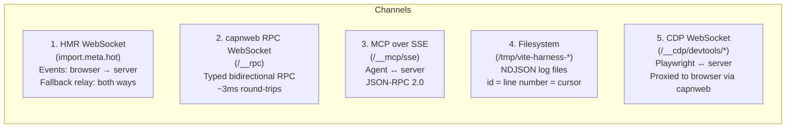
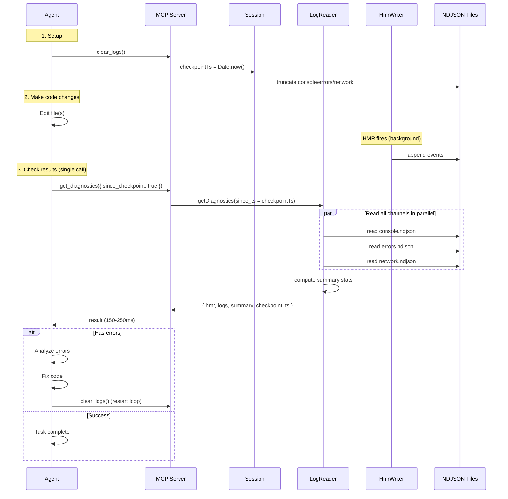
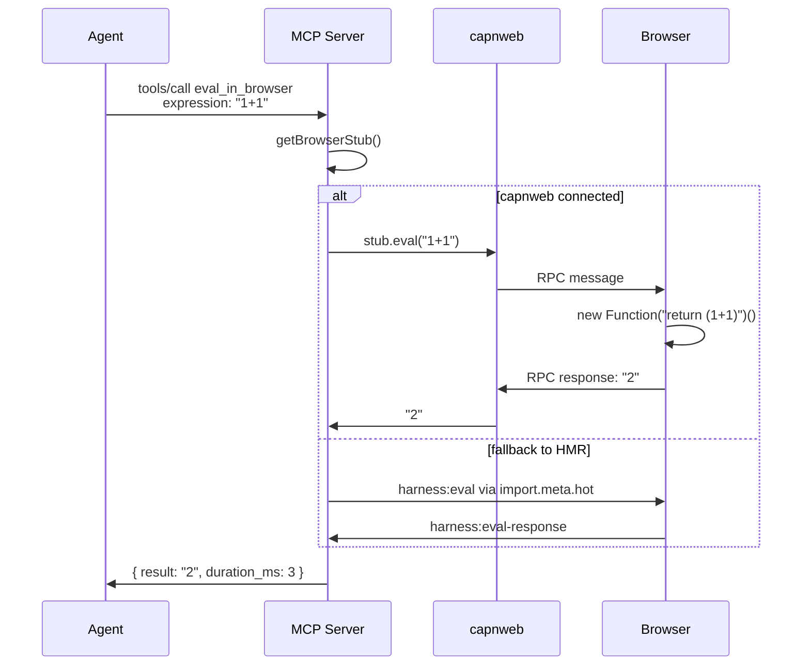
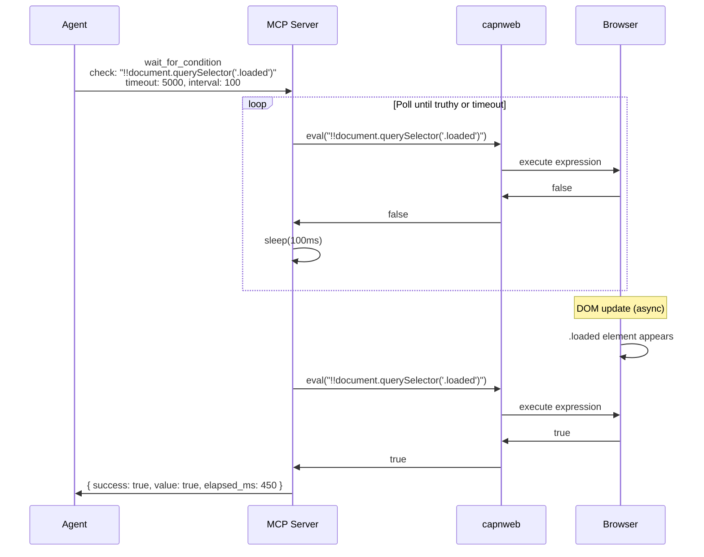
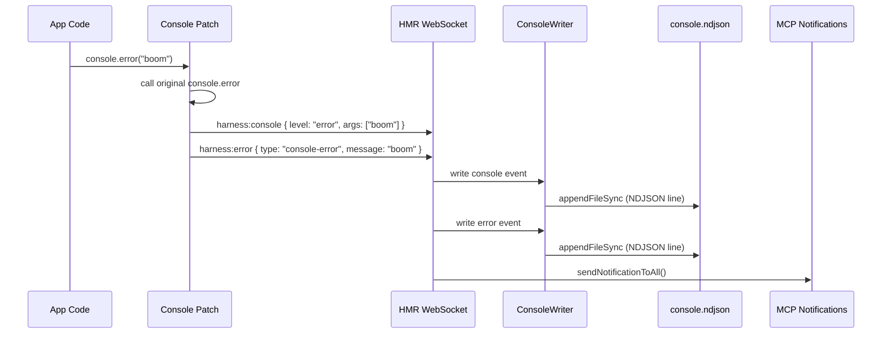
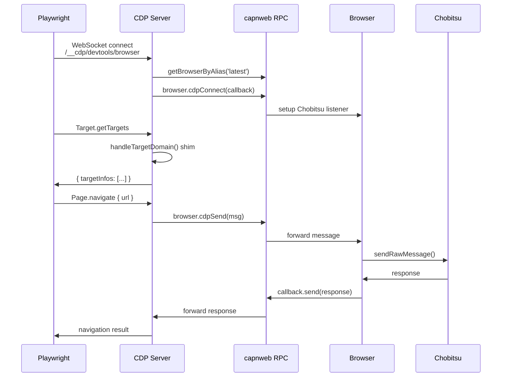
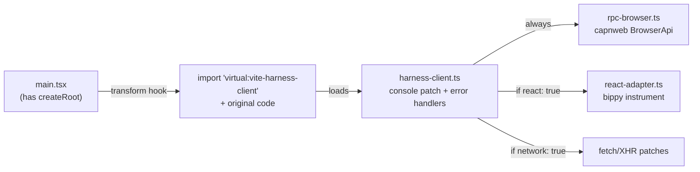

# Architecture

## System Overview

```mermaid
graph TB
    subgraph Browser["Browser (client shim)"]
        CP[Console Patch<br/>log/warn/error/info/debug]
        EH[Error Handlers<br/>error, unhandledrejection]
        NP[Network Patch<br/>fetch/XHR, opt-in]
        HMR_H[HMR Relay Handlers<br/>eval, query-dom, react-tree<br/>fallback path]
        RPC_B[capnweb BrowserApi<br/>document · window · localStorage<br/>sessionStorage · eval · queryDom]
        ANY_T[AnyTarget proxy<br/>full DOM/Storage/Window API<br/>dynamic method forwarding]
        RA[React Adapter<br/>bippy instrument, opt-in]
    end

    subgraph Server["Vite Dev Server (single process)"]
        PLG[Plugin<br/>configureServer · hotUpdate<br/>resolveId · load · transform]
        MCP[MCP Server<br/>/__mcp/sse<br/>SSEServerTransport per connection]
        RPC_S[capnweb RPC Server<br/>/__rpc WebSocket<br/>RpcSession per browser tab]
        CDP_S[CDP Server<br/>/__cdp WebSocket<br/>Playwright connectOverCDP]
        WR[Writers<br/>console · hmr · errors · network]
        LR[Log Reader<br/>NDJSON parse + filter + paginate]
        AR[Auto Register<br/>.mcp.json · .cursor · .windsurf]
        SESS[Session Manager<br/>hash · log dir · session.json]
    end

    subgraph External["External Tools"]
        PW[Playwright<br/>connectOverCDP]
    end

    subgraph Disk["Filesystem"]
        FILES["/tmp/vite-harness-{hash}/<br/>session.json<br/>console.ndjson<br/>hmr.ndjson<br/>errors.ndjson<br/>network.ndjson<br/>react.ndjson"]
    end

    subgraph Agent["AI Agent (Claude Code / Cursor / Windsurf)"]
        TOOLS[MCP Tools<br/>get_session_info · get_diagnostics<br/>get_hmr_status · get_logs<br/>clear_logs (checkpoint) · wait_for_condition<br/>eval_in_browser · query_dom<br/>get_react_tree]
        SHELL[Shell Tools<br/>grep · tail · cat on NDJSON files]
    end

    CP -->|harness:console| WR
    EH -->|harness:error| WR
    NP -->|harness:network| WR
    WR --> FILES
    LR --> FILES
    SESS --> FILES

    RPC_B <-->|"capnweb WebSocket (/__rpc)"| RPC_S
    ANY_T -.->|proxy stubs| RPC_B
    HMR_H <-->|"HMR WebSocket (import.meta.hot)"| PLG

    TOOLS <-->|"SSE + POST (/__mcp/sse)"| MCP
    MCP --> RPC_S
    MCP --> LR
    MCP --> PLG
    SHELL --> FILES

    PLG --> WR
    PLG --> SESS
    PLG --> AR

    PW <-->|"CDP WebSocket (/__cdp)"| CDP_S
    CDP_S -->|proxy via| RPC_S
```

## Communication Channels



### 1. HMR WebSocket (import.meta.hot)

Vite's built-in WebSocket. Browser pushes events via `import.meta.hot.send('harness:*', payload)`. Server listens with `server.hot.on('harness:*', handler)` and writes to NDJSON files. Also used as fallback for eval/query when capnweb isn't connected.

### 2. capnweb RPC WebSocket (/__rpc)

[capnweb](https://github.com/cloudflare/capnweb) object-capability RPC. Browser exposes `BrowserApi extends RpcTarget` with `document`, `window`, `localStorage`, `sessionStorage` getters. Each returns an `AnyTarget` proxy that dynamically forwards any property access or method call to the real browser object. Full DOM/Storage/Window API available without explicit declarations. ~3ms per call.

### 3. MCP over SSE (/__mcp/sse)

`@modelcontextprotocol/sdk` with `SSEServerTransport`. Each SSE connection gets its own `McpServer` instance. Tool handlers share state via `McpContext`.

### 4. Filesystem (NDJSON)

Event logs in `/tmp/vite-harness-{hash}/`. Each line: `{ id, ts, channel, payload }`. Files truncated on dev server start, rotated at `maxFileSizeMb`.

### 5. CDP WebSocket (/__cdp/devtools/*)

Chrome DevTools Protocol endpoint for Playwright `connectOverCDP`. Server-side proxy that forwards CDP commands to the browser via capnweb RPC + Chobitsu (in-browser CDP).

**Endpoints:**
- `/__cdp/json/version` — browser version info (HTTP)
- `/__cdp/json` — list connected pages (HTTP)
- `/__cdp/devtools/browser` — WebSocket for latest browser
- `/__cdp/devtools/page/:id` — WebSocket for specific browser by sticky ID

**Architecture:** CDP does NOT create another browser WebSocket. The CDP WebSocket is server-side only (Playwright connects to it). Commands are proxied through capnweb RPC:

```
Playwright → CDP WS (server) → capnweb RPC → Browser → Chobitsu
```

**Target Domain Shims:** Playwright sends Target/Browser domain commands that Chobitsu doesn't implement. Server-side shims handle: `Target.setDiscoverTargets`, `Target.getTargets`, `Target.attachToTarget`, `Browser.getVersion`, etc.

## Data Flow: Agent Test/Fix Loop (Optimized)



**Performance comparison:**

Old approach (4 separate calls):
```
get_hmr_status()                 → 50-80ms
get_logs({ channel: "errors" })  → 60-100ms
get_logs({ channel: "console" }) → 60-100ms
get_logs({ channel: "network" }) → 60-100ms
Agent-side summary computation   → 10-20ms
Total: 240-400ms
```

New approach (1 consolidated call):
```
get_diagnostics()                → 150-250ms
Total: 150-250ms (2-3x faster)
```

## Data Flow: eval_in_browser



## Data Flow: wait_for_condition



**Benefits:**
- **No manual polling loops** in agent code
- **Single MCP call** replaces multiple eval + sleep cycles
- **Server-side timing** — more accurate, no network latency per poll
- **Configurable** timeout/interval for different scenarios

**Fallback:** If capnweb not connected, uses HMR relay path (same as `eval_in_browser`).

## Data Flow: Console Event → NDJSON



## Data Flow: Playwright CDP Command



## Virtual Module Injection



All virtual modules are plain JavaScript — Vite does not run TypeScript transforms on virtual modules.

## MCP Tool Optimizations

### get_diagnostics() — Consolidated Endpoint

**Problem:** Agent test/fix loops typically require 4-5 separate MCP calls:
```
get_hmr_status() → 50-80ms
get_logs({ channel: "errors" }) → 60-100ms
get_logs({ channel: "console" }) → 60-100ms
get_logs({ channel: "network" }) → 60-100ms
Total: 230-380ms + manual summary computation
```

**Solution:** Single `get_diagnostics()` call returns all channels + HMR status + auto-computed summary.

**Performance:** **2-3x faster** (150-250ms typical). Reduced round trips, single file I/O pass per channel.

**Returns:**
- `hmr`: HMR status (update/error counts, pending state)
- `logs`: console + errors + network events (filtered/paginated)
- `summary`: auto-computed stats (error_count, warning_count, failed_requests, has_unhandled_rejections)
- `checkpoint_ts`: timestamp from last `clear_logs()`

**Filtering:**
- `since_checkpoint: true` — events since last `clear_logs()`
- `since_ts: number` — events since Unix timestamp
- `level`, `search`, `limit` — same as `get_logs()`

**Implementation:** `src/log-reader.ts` — `getDiagnostics()` reads all 3 channels in parallel, computes summary by scanning payloads for error/warning levels and HTTP 4xx/5xx status codes.

### wait_for_condition() — Server-Side Polling

**Problem:** Agents manually poll for async conditions:
```
while (timeout not reached) {
  result = eval_in_browser({ expression: "condition" })
  if (result) break
  sleep(interval)
}
```
Multiple round trips, agent-side timing logic.

**Solution:** Server-side polling that blocks until condition is truthy or timeout.

**Parameters:**
- `check` (required) — JavaScript expression (must return truthy)
- `timeout` — ms, default 5000
- `interval` — poll interval ms, default 100

**Returns:**
```typescript
{ success: boolean, value: any, elapsed_ms: number }
```

**Implementation:** `src/mcp-server.ts` — tool handler wraps `eval_in_browser()` in a while loop with `setTimeout()` promises. Uses same RPC path (capnweb or HMR fallback).

**Example use cases:**
- Wait for DOM element to appear
- Wait for state variable to reach value
- Wait for async data load to complete

### clear_logs() — Checkpoint Mode

**Enhancement:** Now sets `session.checkpointTs = Date.now()` in addition to truncating files.

**Benefit:** `get_diagnostics({ since_checkpoint: true })` filters to events after checkpoint. Clean iteration without losing full trace history.

**Pattern:**
```
1. clear_logs() → checkpoint = T1
2. make code changes → HMR fires
3. get_diagnostics({ since_checkpoint: true }) → only events since T1
4. analyze, fix, repeat from step 1
```

**Implementation:** `src/session.ts` — `checkpointTs` stored in `SessionState`. `src/log-reader.ts` — `getDiagnostics()` uses `since_ts: session.checkpointTs` if `since_checkpoint: true`.

## Component Map

```
src/
  index.ts              ← exports viteLiveDevMcp()
  plugin.ts             ← Vite plugin hooks, wires everything together
  mcp-server.ts         ← MCP tool definitions, SSE transport, relay helpers
  rpc-server.ts         ← capnweb WebSocket server, browser stub management
                           getBrowserByAlias(), getBrowserById(), waitForBrowser()
  cdp-server.ts         ← CDP HTTP routes + WebSocket proxy for Playwright
                           Target/Browser domain shims, prependListener pattern
  session.ts            ← session ID, log dir, session.json, file truncation
  log-reader.ts         ← NDJSON reader with filtering/pagination
  auto-register.ts      ← writes .mcp.json, .cursor/mcp.json, .windsurf/mcp.json
  cli.ts                ← bin entry, wraps vite createServer
  types.ts              ← shared TypeScript interfaces
  writers/
    base.ts             ← NdjsonWriter (sync append, rotation), BufferedNdjsonWriter
    console.ts          ← console channel writer
    hmr.ts              ← HMR channel writer + status tracking
    errors.ts           ← errors channel writer
    network.ts          ← network channel writer (100ms buffered)
  client/
    harness-client.ts   ← browser shim: console patch, error handlers, fetch/XHR,
                           HMR relay handlers (eval, query-dom), loads RPC + react
    rpc-browser.ts      ← capnweb BrowserApi + AnyTarget dynamic proxy
                           + Chobitsu CDP bridge (cdpConnect, cdpSend, cdpDisconnect)
                           + sticky browser ID via sessionStorage
    react-adapter.ts    ← bippy fiber hook + tree traversal (opt-in)
```
