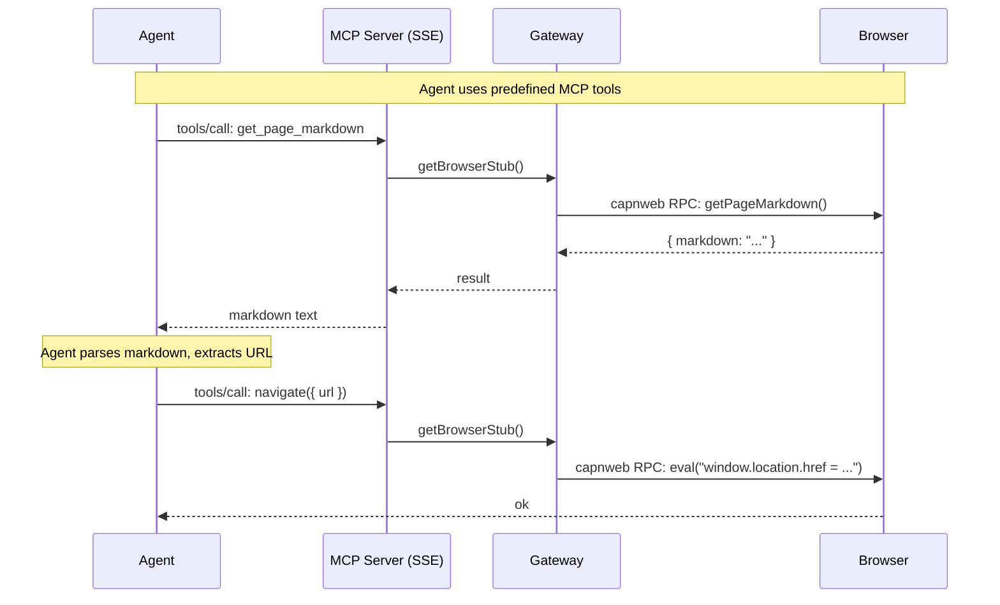
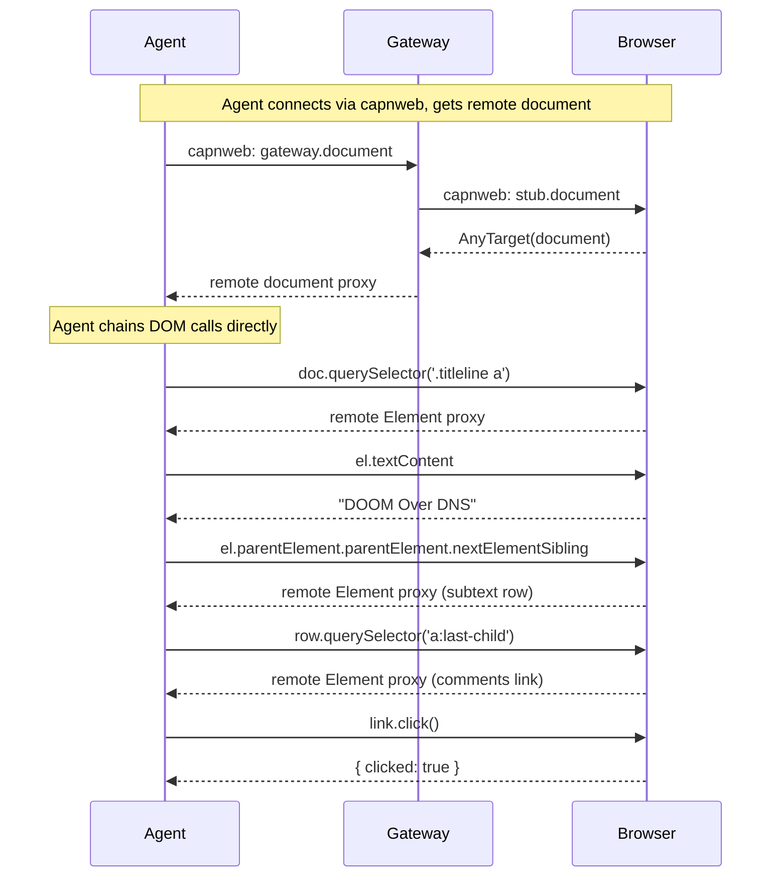
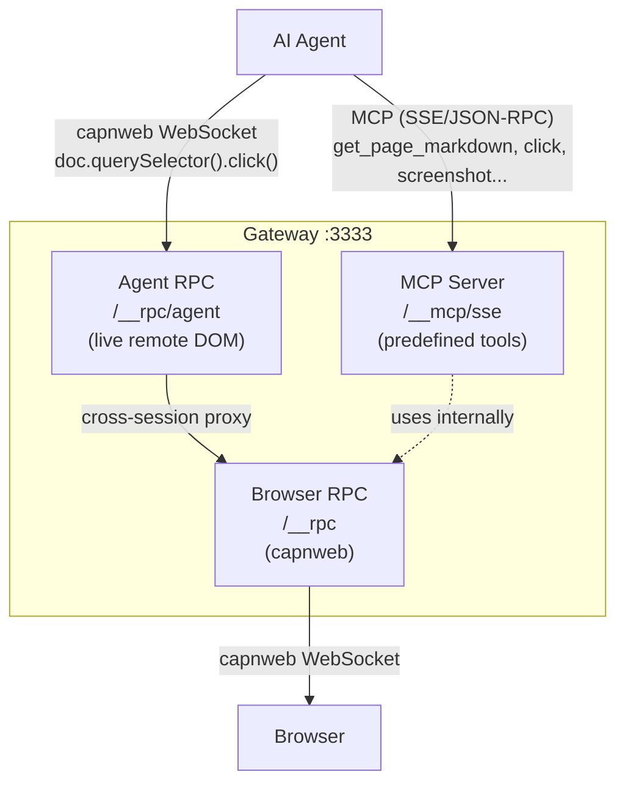

# Agent ↔ Browser Architecture

## What we have now

Agent talks to browser **only through MCP tools** — predefined commands, no live DOM access.



**Limitations:**
- Every interaction is a separate MCP tool call
- Tools are predefined (click, fill, query_dom, etc.)
- No way to chain DOM operations
- `eval_in_browser` blocked by CSP on many sites
- Agent can't traverse DOM — must know exact CSS selector

## What you want

Agent gets **live remote DOM access** — chain querySelector, walk the tree, click elements. Like using DevTools but programmatic.



## Recommended: both paths coexist



**MCP path** — simple, works with any MCP client, good for high-level operations (get diagnostics, take screenshot, get markdown).

**capnweb path** — powerful, live DOM access, chaining, no CSP issues, but requires a capnweb client. An agent SDK or script can use it directly.

Both use the same browser connection. MCP tools internally call the browser stub the same way the agent would through capnweb.

## What needs to be built

1. **`/__rpc/agent` endpoint** — new WebSocket path on gateway. When agent connects, server creates session with a `GatewayApi` target that exposes `document` (proxied from browser stub).

2. **`GatewayApi` RpcTarget** — server-side class that bridges agent session to browser session:
   ```
   class GatewayApi extends RpcTarget {
     get document() { return getBrowserStub().document }
     get window()   { return getBrowserStub().window }
   }
   ```

3. **Client library** (optional) — thin wrapper for agents:
   ```js
   import { connectBrowser } from 'web-dev-mcp/agent'
   const { document } = await connectBrowser('ws://localhost:3333/__rpc/agent')
   const el = await document.querySelector('a')
   await el.click()
   ```

The cross-session capnweb proxy **already works** (tested). Just need to wire up the endpoint.
