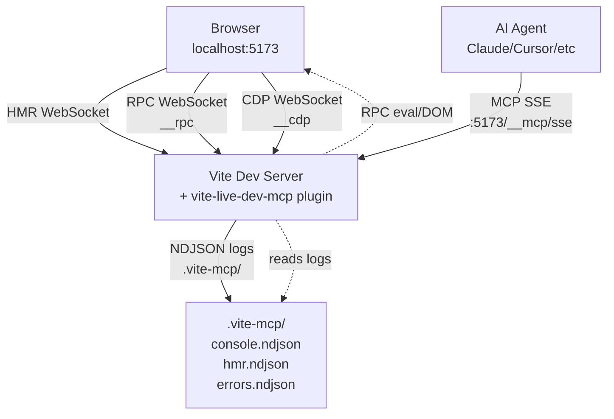
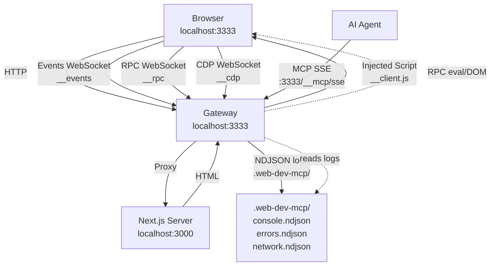
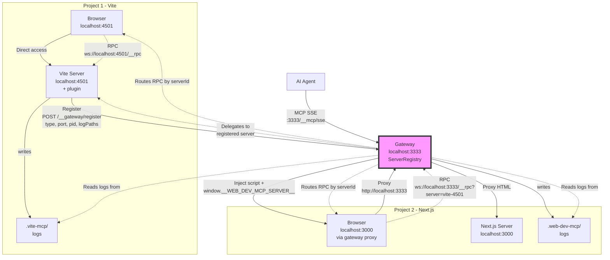
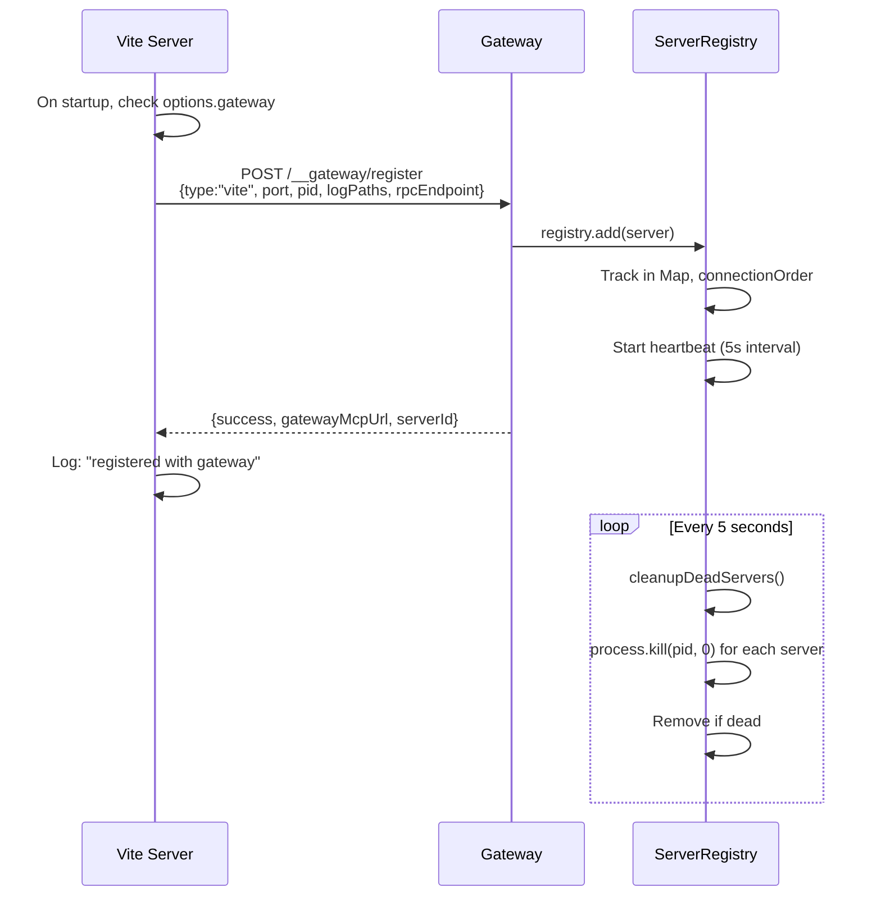
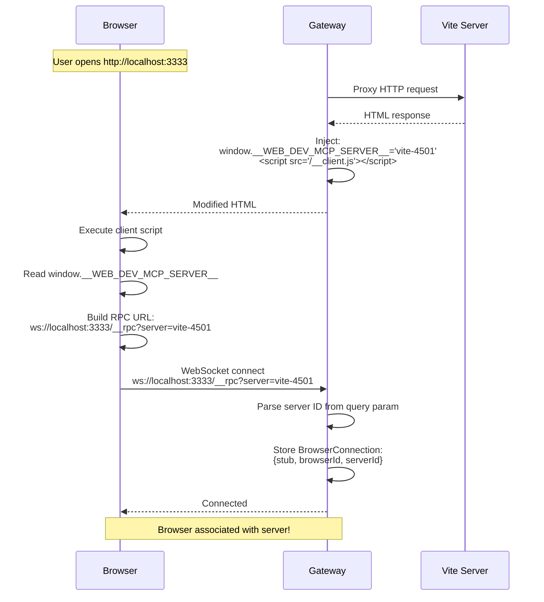
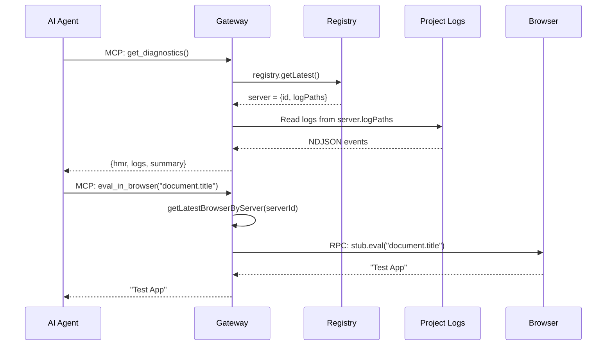

# Web Dev MCP Architecture

## Overview

Three operating modes for live dev observability via MCP:

## 1. Standalone Mode (Vite Plugin Only)



**Characteristics:**
- Direct MCP connection to Vite server
- Logs in project folder: `.vite-mcp/`
- Each restart = new MCP connection
- Port-specific MCP endpoint

---

## 2. Proxy Mode (Gateway Only)



**Characteristics:**
- Gateway proxies non-Vite apps (Next.js, Remix, etc.)
- Injects observability client into HTML
- Logs in gateway folder: `.web-dev-mcp/`
- Single target server
- Persistent MCP endpoint (survives app restarts)

---

## 3. Hybrid Mode (Plugin + Gateway)



**Characteristics:**
- Multiple projects register with single gateway
- Each project keeps its own logs in project folder
- Single persistent MCP endpoint for all projects
- Browser-to-server association via `?server=` query param
- Gateway delegates queries to registered servers
- Automatic cleanup of dead servers (heartbeat)

---

## Registration Flow (Hybrid Mode)



---

## Browser Connection Flow (Hybrid Mode)



---

## MCP Query Routing (Hybrid Mode)



---

## File Structure

```
project-root/
├── .vite-mcp/              # Vite plugin logs (per project)
│   ├── session.json
│   ├── console.ndjson
│   ├── hmr.ndjson
│   ├── errors.ndjson
│   └── network.ndjson
│
├── packages/web-dev-mcp/
│   └── .web-dev-mcp/       # Gateway logs (where gateway runs)
│       ├── session.json
│       ├── console.ndjson
│       ├── errors.ndjson
│       └── dev-events.ndjson
│
└── test-app-nextjs/
    └── .next/              # Next.js build (no MCP logs)
```

---

## Key Design Decisions

### 1. Log Isolation
- **Per-project logs** in `.vite-mcp/` (not `/tmp`)
- Avoids permission issues
- Better organization
- Survives across restarts with stable location

### 2. Browser Association
- `window.__WEB_DEV_MCP_SERVER__` injected by gateway
- Appended to RPC URL: `?server=vite-4501`
- Gateway parses and stores in `BrowserConnection.serverId`
- Enables multi-project browser queries

### 3. Registration API
- Simple HTTP POST to `/__gateway/register`
- Includes `logPaths` for delegation
- Heartbeat cleanup removes dead servers
- No manual unregistration needed

### 4. Query Delegation
- MCP tools check for registered servers
- If hybrid mode: use `registry.getLatest().logPaths`
- If standalone: use plugin's own logs
- Fallback gracefully

---

## API Endpoints

### Gateway Endpoints

| Endpoint | Method | Purpose |
|----------|--------|---------|
| `/__gateway/register` | POST | Register dev server |
| `/__gateway/servers` | GET | List registered servers |
| `/__gateway/unregister/:id` | POST | Remove server |
| `/__status` | GET | Full gateway status |
| `/__mcp/sse` | GET | MCP Server-Sent Events |
| `/__rpc` | WebSocket | RPC for eval/DOM queries |
| `/__cdp` | WebSocket | Chrome DevTools Protocol |
| `/__events` | WebSocket | Browser events stream |
| `/__client.js` | GET | Injected client bundle |

### Vite Plugin Endpoints (when standalone)

| Endpoint | Method | Purpose |
|----------|--------|---------|
| `/__mcp/sse` | GET | MCP Server-Sent Events |
| `/__rpc` | WebSocket | RPC for eval/DOM queries |
| `/__cdp` | WebSocket | Chrome DevTools Protocol |

---

## Current Multi-Project Setup

We already have multi-project in this repo:

1. **test-app** (Vite with plugin)
   - Registers with gateway
   - Logs: `test-app/.vite-mcp/`
   - Can be accessed directly: `http://localhost:4501`

2. **test-app-nextjs** (Next.js, no plugin)
   - Accessed through gateway proxy
   - Logs: Gateway writes to `.web-dev-mcp/`
   - Accessed via: `http://localhost:3333` (gateway proxy)

Both use **one gateway instance** at `localhost:3333` for MCP queries.
