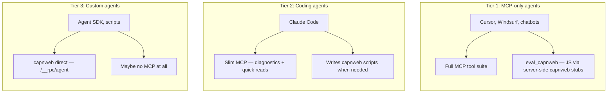

# Agent Capability Tiers

## The problem

21 MCP tools is too many for coding agents that can write scripts. Too few for non-coding agents that need complex browser interaction. One tool surface doesn't fit both.

## Three tiers



## Tier 1: MCP-only agents (no terminal)

**Who:** Cursor, Windsurf, other IDE agents, chatbots, non-coding assistants.

**Constraint:** can only call MCP tools. Cannot write or run scripts.

**Needs:**
- All browser interaction tools (click, fill, hover, etc.)
- All reading tools (query_dom, visible_text, markdown, screenshot)
- Diagnostics + logs
- **`eval_capnweb`** — the key addition

### eval_capnweb

An MCP tool that accepts a JS expression and runs it on the server against capnweb stubs. Not `eval` in the browser — `vm.runInContext` on the server where `document` and `window` are remote proxies.

```json
{
  "name": "eval_capnweb",
  "arguments": {
    "expression": "document.querySelector('a[href*=\"doom\"]').closest('tr').nextElementSibling.querySelector('.subline a:last-child').href"
  }
}
```

→ `"item?id=47490705"`

**Why this matters:**
- CSP-safe (no eval in browser)
- Can chain DOM operations (querySelector → closest → nextSibling)
- Promise pipelining via capnweb (fast)
- MCP-only agents get capnweb power without a terminal

**What it replaces:** Most of the browser interaction tools. Instead of `click(selector)`, do `eval_capnweb("document.querySelector('text=Submit').click()")`. More flexible, fewer tools needed.

### Tier 1 tool list

**Server-side (keep):**
- `get_diagnostics`
- `clear_logs`
- `get_logs`

**Browser convenience (keep for simple actions):**
- `click` / `fill` — one-liners are simpler than eval_capnweb for basic cases
- `screenshot`
- `get_visible_text` / `query_dom` / `get_page_markdown`
- `navigate`

**New:**
- `eval_capnweb` — complex browser interaction without terminal access

**Remove:**
- `eval_in_browser` — replaced by `eval_capnweb` (same but CSP-safe)
- `go_back` / `go_forward` — use navigate or eval_capnweb
- `get_session_info` — fold into diagnostics
- `get_hmr_status` / `get_build_status` — already in diagnostics
- `hover` / `press_key` / `scroll` / `select_option` — eval_capnweb handles these

That's ~10 tools down from 21.

## Tier 2: Coding agents (has terminal)

**Who:** Claude Code, Aider, other terminal-based coding agents.

**Capability:** can write Node.js scripts, run them, read output.

**Needs:**
- Server-side observability (MCP) — diagnostics, logs, HMR status
- Quick reads (MCP) — screenshot, visible_text for fast checks
- capnweb scripts for anything complex

### Tier 2 tool list

**MCP (slim):**
- `get_diagnostics` + `clear_logs`
- `screenshot`
- `click` / `get_visible_text` — quick one-shot actions
- `eval_capnweb` — for when a script is overkill but CSS selector isn't enough

**capnweb (via scripts):**
```js
// Agent writes and runs this as a Node.js script
import { connect } from 'web-dev-mcp-gateway/agent'
const { document } = await connect('ws://localhost:3333/__rpc/agent')
// ... full DOM access
```

### Configuration

```json
{
  "mcpServers": {
    "web-dev-mcp": {
      "type": "sse",
      "url": "http://localhost:3333/__mcp/sse",
      "capabilities": "coding-agent"
    }
  }
}
```

Or flag on the gateway:

```bash
npx web-dev-mcp --tools slim    # diagnostics + screenshot + click + eval_capnweb
npx web-dev-mcp --tools full    # all 10+ tools for MCP-only agents
npx web-dev-mcp --tools minimal # diagnostics only
```

## Tier 3: Custom agents (direct capnweb)

**Who:** Agent SDK builders, automation scripts, custom tools.

**Needs:** Just `/__rpc/agent` WebSocket endpoint. No MCP.

```js
import { connect } from 'web-dev-mcp-gateway/agent'
const browser = await connect('ws://localhost:3333/__rpc/agent')
// Full DOM, promise pipelining, no limitations
```

## Implementation priority

1. **Build `eval_capnweb`** — bridges MCP and capnweb, useful for all tiers
2. **Add `--tools` flag** — slim/full/minimal tool sets
3. **Remove tier 4 tools** — go_back, go_forward, get_session_info, get_hmr_status
4. **Test tier 2 workflow** — Claude Code using slim MCP + capnweb scripts in practice
