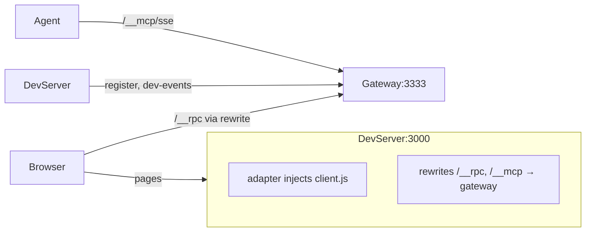

# Gateway Operating Modes

## Mode 1: Fixed proxy (`--target http://localhost:3000`)

Gateway sits in front of a specific dev server. All traffic goes through the gateway.

```mermaid
graph LR
    Browser -->|all requests| Gateway:3333
    Gateway -->|proxy + inject client.js| DevServer:3000

    subgraph Gateway:3333
        MCP[/__mcp/sse]
        RPC[/__rpc]
        CDP[/__cdp]
        Proxy[proxy everything else → target]
    end
```

Use case: any dev server (Rails, Django, Express, etc.) — zero config on the server side.

## Mode 2: Hub mode (no `--target`)

Gateway is a standalone MCP/RPC/CDP hub. Two ways to use it:

### 2a. With adapter (Next.js / Vite plugin)

Dev server has an adapter that injects the client and rewrites MCP/RPC to the gateway.



Use case: Next.js with `withWebDevMcp()`, Vite with `gateway: true`.

### 2b. Dynamic proxy (URL-in-path)

Browse any dev server through the gateway by putting the URL in the path:

```
http://localhost:3333/http://localhost:3000/some/page
```

Gateway proxies the request, injects `client.js` into HTML responses.

```mermaid
graph LR
    Browser -->|/http://devserver/page| Gateway:3333
    Gateway -->|proxy + inject| AnyDevServer

    subgraph Gateway:3333
        MCP[/__mcp/sse]
        RPC[/__rpc]
        CDP[/__cdp]
        DynProxy[dynamic proxy from URL path]
    end
```

Use case: quick instrumentation of any running dev server without config. Like a CORS proxy that also adds MCP observability.

**Note:** relative asset URLs (e.g. `/_next/static/...`) won't route through the proxy automatically — works best for SSR'd pages or SPAs with absolute asset URLs.
