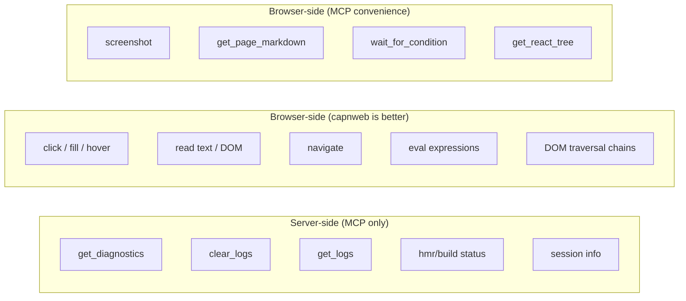

# MCP vs capnweb: when does an agent need each?

## Assume the agent is Claude Code

It can:
- Write and run scripts (Node.js, bash)
- Connect to capnweb via `web-dev-mcp-gateway/agent` in a background process
- Chain DOM calls with promise pipelining
- Read/write files

## What capnweb can do that MCP tools also do

| Capability | MCP tool | capnweb equivalent |
|---|---|---|
| Read text | `get_visible_text(sel)` | `document.querySelector(sel).innerText` |
| Read structure | `query_dom(sel)` | `document.querySelector(sel).innerHTML` |
| Click | `click(sel)` | `document.querySelector(sel).click()` |
| Fill | `fill(sel, val)` | set `.value`, dispatch events |
| Navigate | `navigate(url)` | `browser.navigate(url)` |
| Screenshot | `screenshot()` | `browser.screenshot()` |
| Eval JS | `eval_in_browser(expr)` | just... call methods on document |
| Hover | `hover(sel)` | dispatch MouseEvent |
| Press key | `press_key(key)` | dispatch KeyboardEvent |

capnweb does everything the browser interaction MCP tools do, plus:
- DOM traversal chains (querySelector → parentElement → nextSibling → click)
- Promise pipelining (batched round trips)
- No eval/CSP issues
- Full DOM API, not just predefined operations

## What MCP provides that capnweb CANNOT

| Capability | Why it needs MCP | capnweb can't because... |
|---|---|---|
| **`get_diagnostics`** | Reads NDJSON log files on the server filesystem | capnweb connects to the browser, not the server filesystem |
| **`clear_logs`** | Truncates server-side log files, sets checkpoint | Same — server filesystem operation |
| **`get_logs`** | Queries server-side NDJSON with filtering | Server filesystem |
| **`get_hmr_status` / `get_build_status`** | Reads in-memory HMR/build state on the server | Server process memory, not browser |
| **`wait_for_condition`** | Server-side polling loop | Could be done client-side but MCP blocks until done — useful for agent flow control |
| **`get_session_info`** | Server metadata (log paths, URLs) | Server knowledge |
| **`get_react_tree`** | Bippy fiber walk (could theoretically be capnweb but it's a complex server-coordinated operation) | Maybe possible via capnweb but untested |
| **`get_page_markdown`** | Complex DOM walk with getComputedStyle | Actually this COULD be capnweb — it runs in the browser. But it's a complex function, not a simple DOM chain. |
| **`screenshot`** | html2canvas lazy-load + render | Also runs in browser. Could be capnweb. But returns large base64 — MCP handles this cleanly as image content type. |

## The real split

**MCP's unique value is server-side observability**: log files, HMR status, build events. These are things the browser doesn't know about.

**Browser interaction via MCP is a convenience layer** for agents that can't run scripts. Claude Code CAN run scripts, so for it, capnweb is strictly more powerful for browser interaction.

## Implication for tool design

For Claude Code specifically:

**Keep as MCP tools (server-side, irreplaceable):**
- `get_diagnostics` — the test-fix loop depends on this
- `clear_logs` — checkpoint system
- `get_logs` — granular server-side queries

**Keep as MCP tools (convenience, simpler than scripting):**
- `screenshot` — quick visual check without writing a script
- `click("text=Submit")` — one-liner vs writing capnweb connection boilerplate
- `get_visible_text` / `query_dom` — quick reads

**Demote (capnweb is better):**
- `fill` + `select_option` + `hover` + `press_key` + `scroll` — any multi-step interaction is faster as a capnweb script
- `navigate` + `go_back` + `go_forward` — capnweb handles reconnection
- `eval_in_browser` — capnweb IS eval, but better (no CSP, chainable)

**Question: should Claude Code use capnweb directly?**

If yes: MCP shrinks to ~5 observability tools + a few convenience shortcuts. The agent writes capnweb scripts for anything complex.

If no (MCP only): keep all interaction tools, accept they're limited to single actions per call.

The hybrid approach: MCP for quick reads/clicks/diagnostics. Agent drops into capnweb script when it needs to do something the MCP tools can't express in one call.
