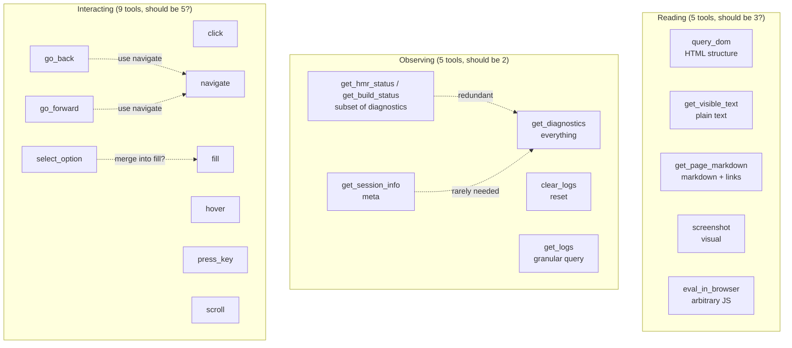

# MCP Tool Analysis

## Tool Matrix

21 tools across both servers. Rated by value for the primary use case: **local frontend development with an AI coding agent.**

### Tier 1 — Core (use every session)

| Tool | What it does | Returns | Perf | Why it's core |
|---|---|---|---|---|
| `get_diagnostics` | Reads all NDJSON log files + HMR/build status + computes summary | `{ hmr, logs: { console, errors, network }, summary }` | Fast (file reads) | **One call replaces 4-5 others.** The test-fix loop depends on this. `since_checkpoint: true` after `clear_logs` is the killer combo. |
| `clear_logs` | Truncates log files, sets checkpoint timestamp | `{ cleared: { console: N, ... } }` | Fast (file truncate) | Enables clean reads. Without this, diagnostics accumulates stale events. |
| `screenshot` | html2canvas renders page/element to PNG | Base64 PNG image | Slow (loads html2canvas from CDN first time, renders) | **Only way to see visual output.** CSS bugs, layout issues, colors — text tools can't catch these. |
| `click` | `el.click()` via CSS selector or `text=` | `{ clicked, tag }` | Fast (1 RPC) | Primary interaction. `text=Submit` selector is key — agents don't always know CSS selectors. |
| `query_dom` | Walks DOM tree, serializes HTML with depth/attribute control | HTML string | Fast (1 RPC, no style computation) | Best for understanding structure. Shows classes, IDs, attributes — what you need to write CSS selectors or debug rendering. Includes hidden elements. |

### Tier 2 — Valuable (use frequently)

| Tool | What it does | Returns | Perf | When to use |
|---|---|---|---|---|
| `fill` | Sets input value + dispatches input/change events | `{ filled, value }` | Fast (1 RPC) | Form testing. Uses native setter for React compatibility. Supports `text=` selectors. |
| `navigate` | Sets `window.location.href` | `{ navigated }` | Fast but **disconnects RPC** | Full page navigation. Connection drops — wait 2-3s for reconnect. For SPA, prefer `click` on a router link. |
| `get_visible_text` | Returns `el.innerText` | `{ text, length }` | Fast (1 RPC, browser computes layout) | Lightweight content check. Layout-aware (skips `display:none`). Good for assertions: "does this element say X?" |
| `eval_in_browser` | `new Function('return (' + expr + ')')` | Serialized string | Fast (1 RPC) | Escape hatch for anything the other tools can't do. Blocked by CSP on non-local sites. Single expressions only (no multi-statement). |
| `get_page_markdown` | Walks DOM, checks `getComputedStyle`, converts to markdown | Markdown string (30KB max) | **Slow** (getComputedStyle per element) | Content reading with links. `[link text](url)` format makes link discovery easy. Form elements shown as `<input placeholder="...">`. Best for: reading content, finding links, understanding page from a user's perspective. |

### Tier 3 — Situational (use when needed)

| Tool | What it does | Returns | Perf | When to use |
|---|---|---|---|---|
| `wait_for_condition` | Server-side poll: eval expression until truthy or timeout | `{ success, value, elapsed_ms }` | Blocks (100ms intervals) | Async UI: loading spinners, toasts, animations completing. Saves agent from polling loop. |
| `get_logs` | Query specific NDJSON channel with filtering | `HarnessEvent[]` | Fast (file read) | When `get_diagnostics` is too broad. Filter by channel, level, search text, cursor. |
| `press_key` | Dispatches keydown/keypress/keyup | `{ key, target }` | Fast (1 RPC) | Keyboard shortcuts, Enter to submit, Escape to close modal. Supports modifiers (ctrl/shift/alt/meta). |
| `select_option` | Sets `<select>` value by value or text | `{ selected, value, text }` | Fast (1 RPC) | Dropdown interaction. Could arguably be merged into `fill`. |
| `hover` | Dispatches mouseenter/mouseover | `{ hovered }` | Fast (1 RPC) | Tooltip testing, hover states, dropdown menus. |
| `scroll` | `scrollIntoView` or `scrollTo` | `{ scrolledTo }` | Fast (1 RPC) | Lazy-loaded content, infinite scroll, bringing elements into view. |
| `get_react_tree` | Bippy fiber walk → component tree | `{ tree, component_count }` | Medium (fiber traversal) | React-specific debugging. Requires `react: true` option + bippy installed. Shows component names, props, state. |

### Tier 4 — Low value (consider removing)

| Tool | What it does | Problem | Alternative |
|---|---|---|---|
| `get_session_info` | Returns log dir, file paths, URLs | Agent rarely needs this. Useful for debugging the tool itself, not for dev work. | Print on startup, or include in first `get_diagnostics` call. |
| `get_hmr_status` / `get_build_status` | HMR/build counts and pending state | Already included in `get_diagnostics`. Separate tool is redundant. | `get_diagnostics` |
| `go_back` / `go_forward` | `history.back()` / `history.forward()` | Niche. Navigation via URL or click is more explicit. Also disconnects RPC same as `navigate`. | `navigate(url)` or `click` on a back button |

## Overlap Analysis

## Recommendation

**Cut to 14** by removing tier 4 (get_session_info, get_hmr_status/get_build_status, go_back, go_forward) and merging select_option into fill.

**Or cut to 8** by consolidating reading tools into `read_page(mode)` and interaction tools into `interact(action)`. Downside: less discoverable in tool listings.

**Most impactful change:** make `text=` selectors the default example in all tool descriptions. Agents reach for `click("text=Submit")` more naturally than `click("#btn-submit-form")`.
